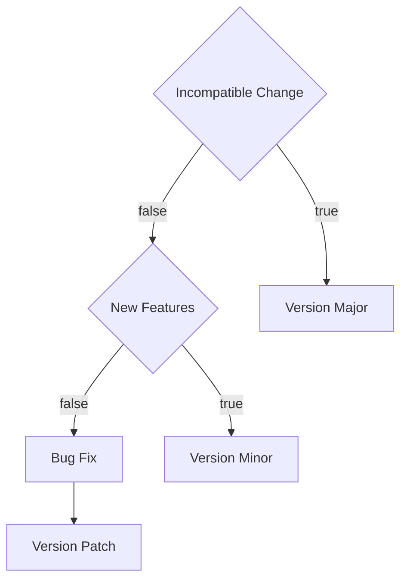

# CloudTower UI KIT

The Source Code is Maintained on [github](https://github.com/webzard-io/cloud-tower-ui-kit)

## Recommended VSCode Config

**.vscode/extensions.json**

```json
{
  "recommendations": [
    "dbaeumer.vscode-eslint",
    "esbenp.prettier-vscode",
    "EditorConfig.EditorConfig"
  ]
}
```

**.vscode/settings.json**

```json
{
  "editor.codeActionsOnSave": {
    "source.fixAll.eslint": true
  },
  "[typescriptreact]": {
    "editor.defaultFormatter": "esbenp.prettier-vscode"
  },
  "[typescript]": {
    "editor.defaultFormatter": "esbenp.prettier-vscode"
  },
  "editor.formatOnSave": true
}
```

## Quick Start

- Install Deps

  At Root of Project, Run

  ```
  yarn
  ```

- Build Packages

  > Due to Codegen's code, It will take 10min.

  > You can remove part of the codegen code, for qucik start.

  > Please check branch `smaller` 's commit `tmp: remove some codegen component`.

  At Root of Project, Run

  ```
  yarn build
  ```

- Start Stroy

  At Story Folder, Run a Storybook

  ```
  yarn storybook
  ```

  Or

  At Story Folder, Run a CRA Project

  ```
  yarn start
  ```

## About Husky

husky is enabled for foramt code and check eslint error.

It will run `lint-staged` at pre-commit.

However, it is still strongly recommended to use vscode configuration, engineers should guarantee code quality.

If you are using Yarn + Windows. You can check this document https://typicode.github.io/husky/#/?id=yarn-on-windows

## Version Update

use lerna cli for quick version update

```
yarn lerna version patch
```



## Key Points of Migration

- Images
- Graphql Schema
- Codegen Plugin

Images is copied from @tower/ui

Graphql Schema not been maintenance in ui-kit, Note the relationship between UI-kit and the Graphql schema.

Codegen Plugin is copying from @tower/codegen

## Packages Introduction

### @cloudtower/eagle

- Antd-Kit Impl
- Codegen Component
- UI-Kit Interface And EmptyImpl
- Base Component

### @cloudtower/claw

- Codegen Plugin

### @cloudtower/parrot

- I18n for @cloudtower/sparrow's UI-Kit
