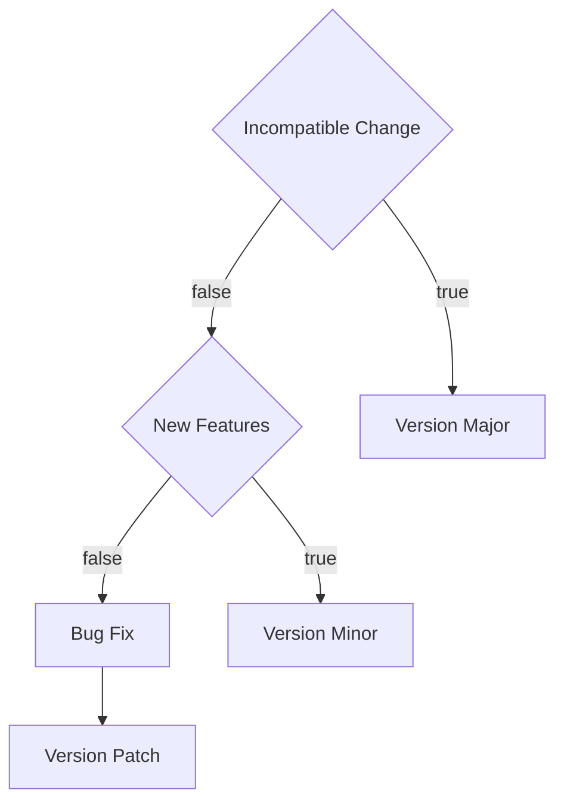

# CloudTower UI KIT

The Source Code is Maintained on [github](https://github.com/webzard-io/cloud-tower-ui-kit)

## Recommended VSCode Config

**.vscode/extensions.json**

```json
{
  "recommendations": [
    "dbaeumer.vscode-eslint",
    "esbenp.prettier-vscode",
    "EditorConfig.EditorConfig"
  ]
}
```

**.vscode/settings.json**

```json
{
  "editor.codeActionsOnSave": {
    "source.fixAll.eslint": true
  },
  "[typescriptreact]": {
    "editor.defaultFormatter": "esbenp.prettier-vscode"
  },
  "[typescript]": {
    "editor.defaultFormatter": "esbenp.prettier-vscode"
  },
  "editor.formatOnSave": true
}
```

## Quick Start

- Install Deps

  At Root of Project, Run

  ```
  yarn
  ```

- Build Packages

  At Root of Project, Run

  ```
  yarn build
  ```

- Start Stroy

  At Story Folder, Run a Storybook

  ```
  yarn storybook
  ```

## About Husky

husky is enabled for foramt code and check eslint error.

It will run `lint-staged` at pre-commit.

However, it is still strongly recommended to use vscode configuration, engineers should guarantee code quality.

If you are using Yarn + Windows. You can check this document https://typicode.github.io/husky/#/?id=yarn-on-windows

## Version Update

use lerna cli for quick version update

```
yarn lerna version patch
```



## Key Points of Migration

- Images

Images is copied from @tower/ui

## Packages Introduction

generate tree list

```
tree -d -I "node_modules|dist"
```

```
├── packages
│   ├── eagle
│   │   ├── src
│   │   │   ├── components
|   |   |   |   ├── KitStoreProvider (Store Provider,Redux hooks)
│   │   │   │   ├── antd.tsx
│   │   │   │   └── ...
│   │   │   ├── hooks
│   │   │   ├── spec (kitContext defined)
│   │   │   ├── store
│   │   │   ├── styles
│   │   │   └── utils
│   │   ├── __test__
│   │   └── tools
│   │       └── templates
│   └── parrot
│       ├── src
│       │   └── locales
│       │       ├── en-US
│       │       └── zh-CN
│       └── tools
│           └── templates
└── story
```

## How To Release

1. Checkout a new branch named `ci` from main
2. Do Version Update [Version Update](#version-update)
3. Push to Gitlab

```
git push gitlab ci
```
