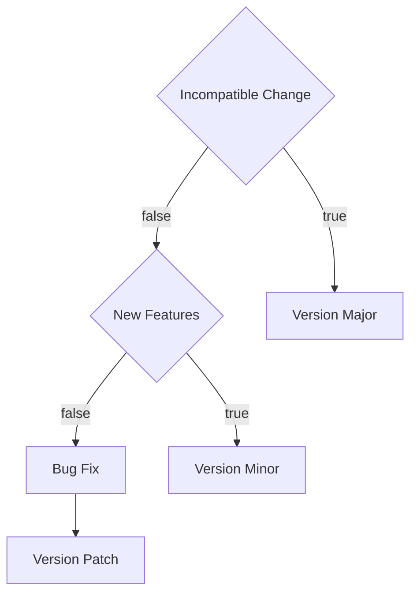

## Version Update

use lerna cli for quick version update

```
yarn lerna version patch --exact --force-publish
```



## How To Release

1. Checkout a new branch named `${ci_branch}` from main

   ```
   git switch -c ${ci_branch} origin/main
   ```

2. Do Version Update [Version Update](#version-update)

   ```
   yarn lerna version patch --exact --force-publish
   ```

   or

   ```
   yarn lerna version ${your_version} --exact --force-publish
   ```

3. Push To Gitlab

   It will trigger ci on gitlab

   ```
   git push gitlab ${ci_branch} --follow-tags
   ```

4. Create PR

   After Released,Please Create a PR.

   Source is `${ci_branch}`

   Target is `main`

   Make the version in the main branch up to date.
