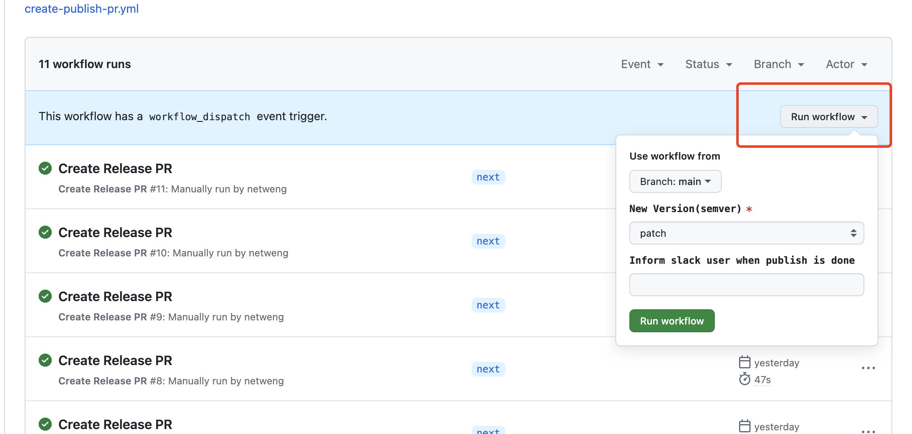
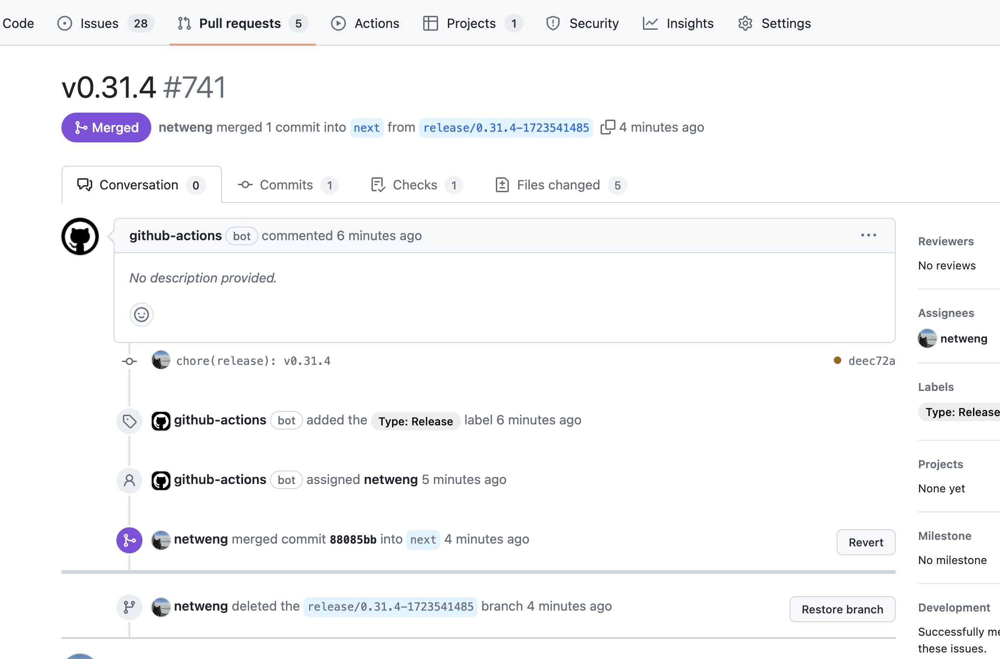
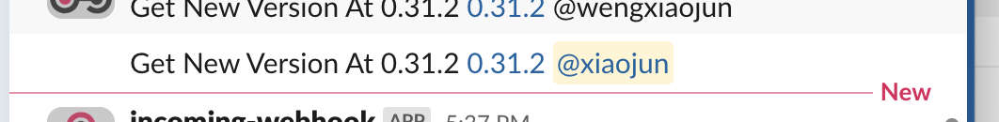
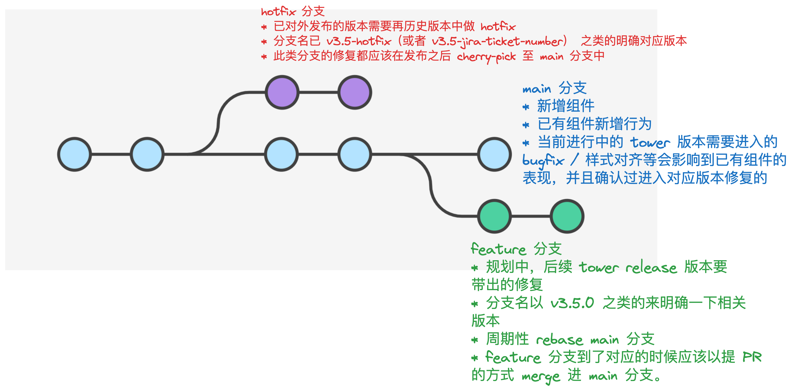

# 如何发版

## 触发 CI

1. 进入到 [Create Release PR](https://github.com/webzard-io/cloudtower-ui-kit/actions/workflows/create-publish-pr.yml) 的 workflow 界面

2. 触发 workflow，选择发 patch 版本还是 minor 版本， 选择对应分支，目前只有 main/next 可以触发发包，填上 slack 通知用户，发版成功后，会在 slack channel 对应通知用户

3. workflow 会自动创建 PR, PR 确认版本正确后，可自行合入

4. 合入成功后，后续会自动进行 release 的流程，然后发送对应版本通知步骤一填入的 slack user

## 如何确定相关 PR 应该进入到哪个分支

目前 UI-KIT 的版本和分支维护主要考虑的是搭配的 CloudTower 版本，活跃分支和对应 CloudTower 的关系如下：

